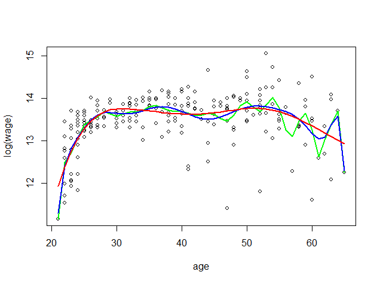
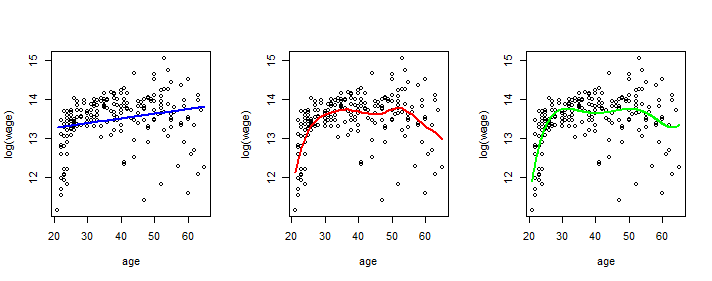
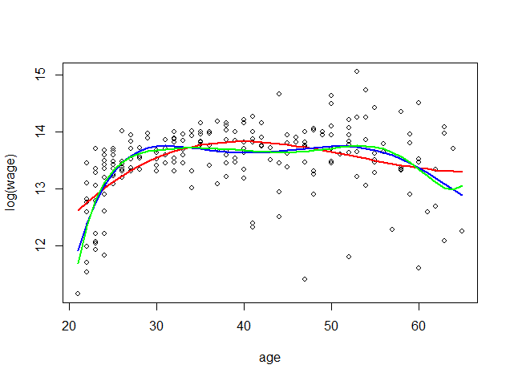

[](http://quantlet.de/)

## [](http://quantlet.de/) **SIEVE_application** [](http://quantlet.de/)

```yaml


Name of QuantLet : SIEVE_application

Published in : METIS

Description : "Results of different types of sieves applied in the data 'cps71' provided in the R package of 'KernSmooth'.
Comparing fitting results of linear regression, local smoothers and sieve estimation. Graphic showing the regression curves 
of sieve with different dimensions."

Keywords : 'Sieve-estimation, kernel-estimator, local-polynomial, polynomial-sieves, splines, B-splines, Spline-sieves, 
non-linear estimation, non- and semi-parametric'

Author : Bingling Wang

Submitted : Wed, March 27 2019 by Bingling Wang

Example: 
- 1: Comparison of regression curves of linear regression, local smoothers and sieve estimation.
- 2: Comparison of B-spline regression with the degree of 3, 10 and 25


```







### R Code
```r

rm(list = ls())
setwd("C:/Users/ThinkPad/Desktop/TeXBeamer")
library("np")
library(MASS)
library('fda')
library(basefun)

#load data
data("cps71")
X = cps71$age
Y = cps71$logwage

#linear regression
model.lr <- lm(logwage ~ age, data = cps71)
summary(model.lr)

#Parametric model
model.par <- lm(logwage ~ age + I(age^2), data = cps71)
summary(model.par)

#Kernel estimation
model.np <- npreg(logwage ~ age, 
                  regtype = "ll",
                  bwmethod = "cv.aic",
                  gradients = TRUE,
                  data = cps71)
summary(model.np)


#B-spline estimation
ra         = range(X)#boundary knots
numk       = 3 #number of inner knots
mid        = seq(ra[1], ra[2], length.out = numk +2)[2: (numk+1)]#inner knots (quantiles)
deg        = 3 #degree
numb       = 3+ deg + 1#number of basis

#generate basis functions
basis3 = bs(X, df = NULL, knots = mid, degree = deg, intercept = T,  Boundary.knots = range(X))
plot(X,basis[,1],"l")#plot basis functions
lines(X,basis[,2])
lines(X,basis[,3])
lines(X,basis[,4])
lines(X,basis[,5])
lines(X,basis[,6])
lines(X,basis[,7])
 
#fit the model
model.Bspline1 = lm ( logwage ~ basis1, data = cps71)
model.Bspline2 = lm ( logwage ~ basis2, data = cps71)
model.Bspline3 = lm ( logwage ~ basis3, data = cps71)


#polynomial sieve
degree_pol = 8
array_pol3 = array(0, dim = c(degree_pol, length(X)))
for (i in 0:degree_pol){
  if (i+1<= degree_pol){
    array_pol3 [i+1,] = X^i
  }
}
basis_pol3 = t(as.matrix(array_pol3))                  
model.pol3 = lm ( logwage ~ basis_pol3, data = cps71)

#plot the results
par(mfrow = c(1,3))
plot(cps71$age, cps71$logwage, xlab = "age", ylab = "log(wage)", cex=.9)
lines(cps71$age, fitted(model.lr), lty = 1, col = "blue", lwd = 2)
lines(cps71$age, fitted(model.np), lty = 1, col = "red", lwd = 2)
lines(cps71$age, fitted(model.par), lty = 1, col = " green", lwd = 2)
legend(22,15, c("Linear regression","Kernel estimation","parametric estimation"),lty = c(1,2,4) ,fill=c("blue","red","black"),cex=0.8)

lines(cps71$age, fitted(model.Bspline3), lty = 1, col = "green", lwd = 2)
lines(cps71$age, fitted(model.Bspline2), lty = 1, col = "blue", lwd = 2)
lines(cps71$age, fitted(model.Bspline1), lty = 1, col = "red", lwd = 2)
legend(22,15, c("D=3","D=10","D=25"),lty = 1 ,fill=c("red","blue","green"),cex=0.8)

lines(cps71$age, fitted(model.pol1), lty = 1, col = "red", lwd = 2)
lines(cps71$age, fitted(model.pol2), lty = 1, col = "blue", lwd = 2)
lines(cps71$age, fitted(model.pol3), lty = 1, col = "green", lwd = 2)
legend(22,15, c("D=4","D=6","D=8"),lty = 1 ,fill=c("red","blue","green"),cex=0.8)

#################################################################################


```

automatically created on 2019-04-01